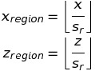
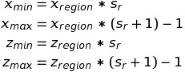
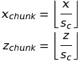
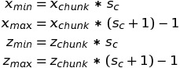

# PyBlock

This tool helps to explore and examine your minecraft world. Find special blocks or get some overview of what you can find in your region/area of interest!

## Details

The world in minecraft is divided into regions (making up the files the world is stored in), and each region is divided into chunks.
The coordinates of a minecraft block (block coordinates) is given by the tuple (x,y,z) where x and z are the coordinates on the minecraft plane, and y is the height. In a normal minecraft world x and z can take values from -31000000 to !31000000 and y can be between 0 and 255.

### Regions and Chunks

Each region is a 512x512 block area of the map (region coordinates). Each region is stored in a seperate file (named `r.x.z.mca`, e.g. `r.-5.11.mca`). When we define  

s<sub>r</sub>=512

as the region size, the region a block belongs to is



where the brackets denote the `floor` funtion, which returns the closest integer value which is less than or equal to the specified expression or value.

Examples:


In the other way around you might ask the range of a region in block coordinates, then you can calculate it via



### Chunks

Each region is further divided into chunks, which are 16x16 blocks. So when we define 

s<sub>c</sub>=16

as the chunk size, then the chunk coordinates a block belongs to is



and similar the range of a chunk in block coordinates is calculated as 




## Sections

Each chunk itself is further divided into 'sections' which represent a 16x16x16 block area. Each chunk has 16 vertical stacked sections.

These sections are read with the  which handles all the details of how the sections and blocks are stored inside the mca files.


## Usage

This tool can be used in two ways: List all blocks in a certain area or find the location of blocks in a certain area.

In order to use that tool you have to specify the path to your minecraft world. You can do that either by specifying the argument `world` or by specifying the environment variable `MINECRAFTWORLD` (so the actual commands gets more readable).

Example:

```
export MINECRAFTWORLD=/home/user/some/path/minecraft/MyWorld/region
```

### Listing all blocks

`mcblock  --coords 100 40 -400 --radius 40 --list`

This command lists all the blocks found in an cuboid area around the block at coordinates (100,40,-400) within a box-'radius' of 40. The search area is a box with minimal coordinates (60, 0, -440) and maximal coordinates (1400, 80, -360).

You can specify the argument `--vertical` to search the complete vertical column. In the example that would be a box with minimal coordinates (60, 0, -440) and maximal coordinates (1400, 255, -360).

### Finding a block

`mcblock --coords 100 40 -400 --radius 20 --find diamond_ore`

This command lists the exact block coordinates of each occurance of the block type 'diamond_ore' that has been found in the specified search area.

### Analyzing a region

You also can use the tool to analyze a complete region file, e.g.

`mcblock --region -3 5 --list`

### Coordinate conversion

There is a second tool to convert coordinates from block coordinates to region/chunk coordinates:

```
mccoord  --coords 2500 73 -8500
Coordinates: x=2500 / y=73 / z=-8500
Region-file: r.4.-17.mca
Chunk: x=156 / z=-532
```

and the other way around:

```
mccoord  --region 4 -17
Region-file: r.4.-17.mca
Coordinate ranges (inclusive): x: 2048-2559  / z: -8704--8193
```

## Further information

Last update was tested on Minecraft version **1.15.1** with python 3.6.9.


